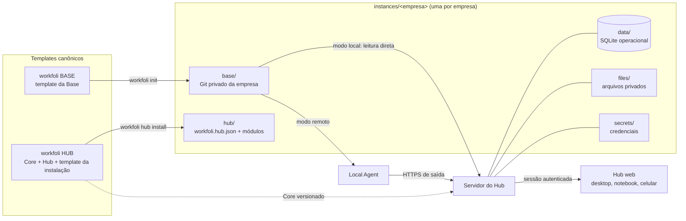

# Arquitetura da Workfoli (implementada)

Estado em 2026-09-24, Core **0.4.0**. Este documento descreve o que existe e funciona. Próximos passos em
[roadmap.md](roadmap.md).

## Princípios

- **A Workfoli é uma empresa de serviços, não um SaaS.** A infraestrutura existe para prestar serviços com contexto acumulado.
- **Uma instalação por empresa (single-tenant).** Cada empresa tem Base, Hub, banco, arquivos privados e credenciais próprios. O motor é compartilhado; os dados não.
- **O próximo trabalho não começa do zero.** A Base acumula o contexto; o Hub o aproveita sem recadastrar nada.
- **Templates limpos.** `workfoli BASE` e `workfoli HUB` nunca contêm dados de clientes; instâncias vivem em `instances/`.

## Componentes



| Componente | Onde | Papel |
|---|---|---|
| Contrato | `packages/contract/` (+ cópia em `workfoli BASE/scripts/`) | Valida `workfoli.base.json`, `workfoli.hub.json`, `workfoli.instance.json`. JavaScript sem dependências; JSON Schemas em `schemas/` |
| Core de domínio | `packages/core/` | Registro de módulos, autoridade por categoria de dado, sensibilidade, classificação e conhecimento (importador) |
| Instância | `packages/instance/` | Criar Base a partir do template, validar no disco, instalar/sincronizar o Hub, atualizar, diagnosticar, cofre de segredos |
| Backend do Hub | `packages/hub/` | Banco com migrações, autenticação, permissões, auditoria, leitura da Base, alterações na Base, serviços, IA, API HTTP |
| CRM | `packages/hub/crm/` | Empresas, contatos, leads, oportunidades, funil com regras da Base, histórico, automações, resultados — ver [crm.md](crm.md) |
| Integrações | `packages/hub/integrations/` | Cofre de tokens, OAuth com PKCE, provedores por token, adaptadores normalizados, sincronização — ver [integracoes.md](integracoes.md) |
| Local Agent | `packages/agent/` | Ponte Base local ↔ Hub hospedado |
| CLI | `packages/cli/` + `bin/workfoli.mjs` | `init`, `base`, `hub`, `agent`, `doctor`, `update`, `secrets`, `sync-contract` |
| Hub web | `apps/hub-web/` → `dist-hub/` | Interface React servida pelo próprio servidor do Hub |
| Importador desktop | `apps/desktop/` + `packages/adapters/` | Ferramenta do operador para analisar material existente (ZIP/pasta) sem executá-lo — ver [importador-desktop.md](importador-desktop.md) |
| Template da instalação | `template/hub/` | README e exemplo de módulo customizado copiados em `hub/` da instância |

## Core vs instância

| Camada | O que é | Onde | Atualização |
|---|---|---|---|
| WORKFOLI CORE | Código genérico | `workfoli HUB/packages`, `apps` | Nova versão do repositório; `workfoli update` migra banco/config/manifesto |
| BASE TEMPLATE | Matriz limpa da Base | `workfoli BASE` | `template.version`; `workfoli base upgrade` aplica em Bases existentes com merge em três vias |
| HUB TEMPLATE | Matriz da instalação | `workfoli HUB/template/hub` | Copiada só na instalação |
| CLIENT CONFIG | Configuração da empresa | `instances/<x>/hub/workfoli.hub.json`, `workfoli.instance.json` | Nunca sobrescrita pelo Core |
| CLIENT DATA | Dados da empresa | `base/` (versionável), `data/`, `files/`, `secrets/` | Migrações com cópia prévia |
| CUSTOM MODULES | Extensões da empresa | `instances/<x>/hub/modules/<id>/module.json` | Declarativos: sem código executável |

A instância fixa a versão do Core (`core.version`). `workfoli doctor` avisa quando o Core instalado
é mais novo; `workfoli update --apply` faz a migração com backup.

## Contrato Base ↔ Hub

O Hub não varre pastas adivinhando: lê o manifesto `workfoli.base.json` (schemaVersion 3), validado
pelo mesmo código na Base e no Core. Detalhes em [contrato-base-hub.md](contrato-base-hub.md). O
manifesto declara empresa, identidade (cores, tipografia, voz, símbolo), raízes de contexto,
serviços, projetos, módulos (e o nome de cada um no menu), a **estrutura do CRM** (funis, etapas e regras,
campos personalizados, origens, motivos de perda, automações, vínculo com integrações), integrações
planejadas (só nomes de credenciais), ativos, recursos, papéis sugeridos e a política de dados.

Regra de fronteira, válida para todo módulo: **Base = configuração e contexto; banco = estado vivo;
Hub = interface e comandos.** A configuração só muda por alteração tipada gravada na Base; os registros só
mudam pelos serviços do Hub. Não há sincronização em laço entre os dois.

## Camadas de dados

| Camada | Tecnologia | Fonte da verdade | Git |
|---|---|---|---|
| Base versionável | Markdown/JSON na pasta `base/` | Base (arquivos) | Sim, repositório privado da empresa |
| Dados operacionais (CRM, tarefas, usuários, papéis, sessões, auditoria, IA, fila de comandos, métricas de marketing sincronizadas) | SQLite (`node:sqlite`, WAL) em `data/hub.sqlite`, esquema v2 | Banco da instância | Nunca |
| Tokens de integração | Cifrados (AES-256-GCM) em `integration_tokens`; chave mestra em `secrets/vault.key` protegida por DPAPI (Windows) ou `WORKFOLI_VAULT_KEY` | Cofre da instância | Nunca |
| Arquivos privados | Arquivos opacos em `files/private/<id>` + metadados e SHA-256 no banco | Instância | Nunca |
| Segredos | `secrets/secrets.env` (nomes no manifesto, valores só aqui) | Cofre da instância | Nunca |
| Derivados (snapshot da Base no modo remoto) | Tabela `snapshot_files` | Reconstruível a partir da Base | Nunca |

Regras aplicadas pelo código: `data/`, `files/` e `secrets/` não podem ficar dentro da Base; o
`doctor` acusa bancos ou `secrets.env` dentro da Base; a verificação da Base bloqueia credenciais em
arquivos versionáveis e alerta sobre registros pessoais (CPF, "Paciente:", CID…).

## Modos do Hub

- **Local** (`mode: local`): o servidor roda na máquina da Base e lê o disco (cache de 3 s). Alterações
  na Base são aplicadas na hora, com revisão esperada e journal em `data/journal/`.
- **Remoto** (`mode: remote`): o Hub não acessa disco da Base. O **Local Agent**, no computador da Base,
  abre conexão de saída, envia o snapshot permitido e aplica a fila de alterações tipadas.

### Local Agent

1. Admin gera código de pareamento (uso único, 1 h) no Hub ou via `workfoli hub pair-code`.
2. `workfoli agent pair <instância> --hub <url> --code <código>`: o Agent confere que o Hub pertence à
   **mesma instância** (instanceId) antes de guardar a credencial em `secrets/agent.json`.
3. `workfoli agent run`: ciclo de snapshot → comandos → recibos, com backoff; `--once` para agendadores.
4. O Hub revalida tudo que recebe (manifesto, caminhos, tamanhos, sensibilidade) e recusa snapshot de outra Base.
5. Comandos carregam o hash do manifesto esperado; se a Base mudou, o Agent recusa e registra falha.
6. Dispositivos podem ser revogados; fora de `localhost`, o Agent exige HTTPS.

## Módulos

`packages/core/modules.ts` registra 23 módulos. Disponíveis (implementados): visão geral, empresa,
conhecimento, projetos, arquivos, tarefas, CRM, **marketing**, integrações, IA, histórico, usuários,
configurações. Planejados (reconhecidos pelo contrato, sem ativação): agenda, site, campanhas, conteúdo,
dashboards, automações, pacientes, mídia, financeiro, desenvolvimento. Perfis (`general`, `services`,
`agency`, `clinic`, `development`, `retail`) só sugerem módulos. Nada é específico de um segmento: o
vocabulário do CRM ("Cliente", "Aluno"…) e o funil são configuração da Base, não código; dados de saúde
pedem módulo próprio com controles.

Módulos customizados são declarativos (`module.json` com campos tipados); os registros ficam no
banco da instância com permissões `<id>:read|write`. Não servem para dados clínicos.

## Usuários e permissões

- Papéis do Core: **Proprietário** e **Administrador** (`*`), **Gestor Workfoli** (equipe da Workfoli a
  serviço da empresa: CRM, integrações, marketing e configurações, sem usuários nem arquivos restritos;
  só o proprietário concede ou retira), **Equipe** e **Leitura**. Papéis sugeridos
  pela Base entram como `base` e só mudam com aprovação do proprietário (`hub sync --apply` ou Configurações).
  Papéis personalizados são criados no Hub (sem administração de usuários/configurações).
- Permissões `escopo:ação` (`read` < `write` < `admin`, `ai:use`, `ai:act`, `files:private`,
  `restricted:read`, `audit:read`, `users:admin`, `settings:admin`), verificadas no servidor em toda rota.
- Invariantes: sempre ao menos um proprietário ativo; só proprietário concede ou retira propriedade;
  ninguém altera o próprio papel; troca de papel ou desativação encerra sessões.

## IA contextual

Fluxo: pedido → interpretação → ação estruturada → confirmação → execução → auditoria.

- O contexto enviado ao provedor é montado **por permissão** (cada bloco só entra se o usuário lê o módulo).
- Provedores: `local` (padrão, determinístico, sem rede), `none`. Provedores externos (`claude-cli`,
  `codex-cli`) exigem `externalContext: true` explícito e ainda não têm adaptador (ficam no local).
- Ações possíveis (lista fechada): criar tarefa, cadastrar contato, registrar lead, criar oportunidade,
  criar projeto na Base, registrar nota na Base, criar registro de módulo customizado. Nenhuma ação destrutiva, de publicação, envio ou pagamento.
- Proposta guarda tipo + dados + hash (30 min). Confirmar exige o hash exibido; permissões e dados são
  revalidados na execução; cada proposta executa uma única vez; tudo vai para a auditoria.

## CRM, integrações e marketing

- **CRM** ([crm.md](crm.md)): funil com regras de etapa vindas da Base, ganho/perda com motivo, conversão de
  lead com sugestão de duplicados, histórico por registro (quem, quando, o quê, de onde), automações
  declarativas, arquivamento e exclusão definitiva (LGPD).
- **Integrações** ([integracoes.md](integracoes.md)): cada empresa conecta as próprias contas pelo navegador
  do sistema (OAuth com `state` e PKCE); tokens cifrados no cofre da instância; adaptadores normalizam Google
  Ads, GA4, Search Console, Meta Ads e formulários de lead; leads entram no CRM só com a regra da Base.
- **Marketing**: separa dado da plataforma, contagens do CRM e cálculos da Workfoli; gráficos de série única na
  cor da marca, com tabela equivalente; ausência de dado nunca vira zero.

## Segurança

Resumo; detalhes em [seguranca.md](seguranca.md): senha com scrypt, links de ativação de uso único,
sessão em cookie `HttpOnly`/`SameSite=Strict` com expiração absoluta e por inatividade, CSRF por
cabeçalho, checagem de `Host` (anti DNS rebinding) e de `Origin`, CSP estrita, limite de tentativas,
auditoria sem valores sensíveis, arquivos privados com verificação de integridade, segredos nunca
expostos pela API.

## Fluxos de linha de comando

Ver [instalacao.md](instalacao.md). Resumo:

```text
workfoli init <slug> --name "Empresa"         # instância nova com a Base a partir do template
workfoli base validate <base>                 # contrato + credenciais + .gitignore
workfoli hub install <instância>              # Hub sobre a Base existente (sem recadastro)
workfoli hub start <instância>                # servidor local (127.0.0.1:4870)
workfoli hub sync <instância> [--apply]       # relê a Base; papéis sugeridos exigem --apply
workfoli doctor [<instância>] [--templates]   # diagnóstico
workfoli update <instância> [--apply]         # migrações com backup
workfoli base upgrade <base> [--apply]        # template novo sem perder customizações
```
